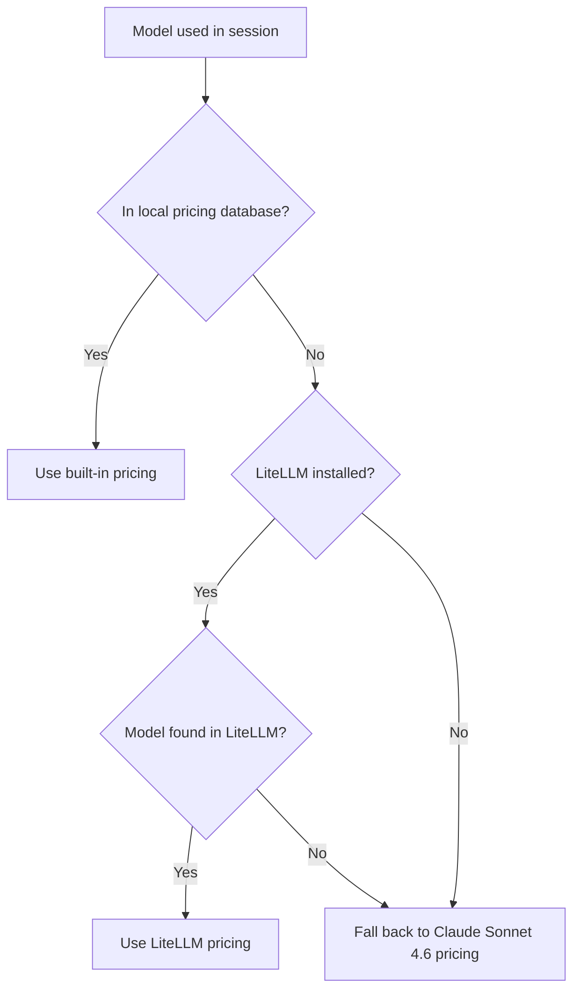

Reverse API Engineer uses Claude models by default and supports Gemini models when running through the OpenCode SDK. The active model is shown in the banner on startup.

## Available models

### Claude models

<Tabs>
  <Tab title="Sonnet 4.6 (default)">
    **Model ID:** `claude-sonnet-4-6`

    The default model. Balanced performance and cost, suitable for most reverse engineering tasks.

    | Token type | Price per 1M tokens |
    |---|---|
    | Input | $3.00 |
    | Output | $15.00 |
    | Cache creation | $3.75 |
    | Cache read | $0.30 |
    | Reasoning | $15.00 |
  </Tab>
  <Tab title="Opus 4.6">
    **Model ID:** `claude-opus-4-6`

    Maximum capability for complex APIs with many endpoints, unusual authentication flows, or intricate data structures. Also the default model when using the OpenCode SDK.

    | Token type | Price per 1M tokens |
    |---|---|
    | Input | $15.00 |
    | Output | $25.00 |
    | Cache creation | $6.25 |
    | Cache read | $0.50 |
    | Reasoning | $25.00 |
  </Tab>
  <Tab title="Haiku 4.5">
    **Model ID:** `claude-haiku-4-5`

    Fastest and most economical. Use for simple APIs or when running many captures in batch.

    | Token type | Price per 1M tokens |
    |---|---|
    | Input | $1.00 |
    | Output | $5.00 |
    | Cache creation | $1.25 |
    | Cache read | $0.10 |
    | Reasoning | $5.00 |
  </Tab>
</Tabs>

### Gemini models

Gemini models are available through the OpenCode SDK with `opencode_provider` set to `"google"`. See [OpenCode SDK](/configuration/sdk) for setup.

| Model ID | Input | Output | Cache creation | Cache read |
|---|---|---|---|---|
| `gemini-3-flash` | $0.50 | $3.00 | $1.00 | $0.05 |
| `gemini-3-pro` | $3.00 | $12.00 | $4.50 | $0.20 |
| `gemini-3-pro-low` | $3.00 | $12.00 | $4.50 | $0.20 |
| `gemini-3-pro-high` | $3.00 | $12.00 | $4.50 | $0.20 |

<Note>All prices are per 1 million tokens in USD. Gemini models at free tier (Antigravity) require the OpenCode SDK with `opencode_provider: "google"`.</Note>

## Changing the model

<Tabs>
  <Tab title="/settings command">
    Inside the CLI, type `/settings` and select **Claude Code Model**:

    ```
    /settings
    → Claude Code Model
    → sonnet 4.6 [balanced]   # claude-sonnet-4-6
    → opus 4.6 [power]        # claude-opus-4-6
    → haiku 4.5 [speed]       # claude-haiku-4-5
    ```
  </Tab>
  <Tab title="CLI flag">
    Pass `--model` (or `-m`) to use a specific model for a single run without changing the saved config:

    ```bash
    reverse-api-engineer manual --model claude-opus-4-6
    reverse-api-engineer agent  --model claude-haiku-4-5
    ```
  </Tab>
  <Tab title="config.json">
    Edit `~/.reverse-api/config.json` directly:

    ```json
    {
        "claude_code_model": "claude-opus-4-6"
    }
    ```
  </Tab>
</Tabs>

## Three-tier pricing fallback

Cost calculation uses a three-tier system so that cost tracking always works, even for models not in the built-in list:



1. **Local pricing** — Built-in prices for Claude 4.x and Gemini 3 models. Highest priority.
2. **LiteLLM pricing** — Requires the `[pricing]` extra. Covers 100+ additional models including OpenAI GPT, Mistral, DeepSeek, and more.
3. **Default pricing** — Uses Claude Sonnet 4.6 rates as an approximation when the model is unknown.

### Installing extended pricing

```bash
# With uv
uv tool install 'reverse-api-engineer[pricing]'

# With pip
pip install 'reverse-api-engineer[pricing]'
```

<Tip>Install the `[pricing]` extra if you use non-Claude/Gemini models through the OpenCode or Copilot SDK. Without it, costs for unknown models will be estimated using Claude Sonnet 4.6 rates.</Tip>

## Cost tracking

Every run records token usage and estimated cost in `~/.reverse-api/history.json`. View costs from previous runs with `/history`.

The following token types are tracked and billed separately:

<ParamField path="body.input_tokens" type="number">
  Tokens sent as input to the model (prompt, system prompt, HAR contents).
</ParamField>

<ParamField path="body.output_tokens" type="number">
  Tokens generated by the model (code, analysis, explanations).
</ParamField>

<ParamField path="body.cache_creation_tokens" type="number">
  Tokens written to the prompt cache. Charged at a higher rate than plain input tokens but reduces cost on subsequent reads.
</ParamField>

<ParamField path="body.cache_read_tokens" type="number">
  Tokens read from the prompt cache. Charged at a lower rate than plain input tokens.
</ParamField>

<ParamField path="body.reasoning_tokens" type="number">
  Tokens produced during extended thinking. Only applies to `-thinking-*` model variants.
</ParamField>
